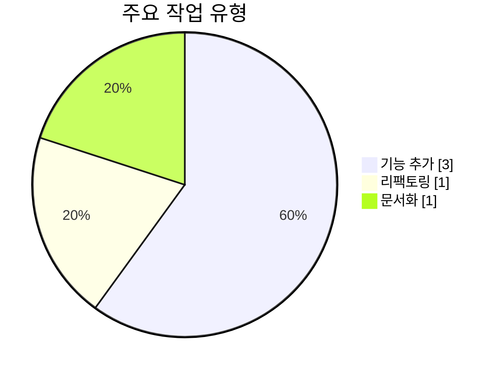

<!--
🔄 이 파일은 fe-shared-project에서 자동 동기화됩니다
관리 위치: https://github.com/musinsa/fe-shared-project
⚠️ 이 파일을 직접 수정하지 마세요. 다음 동기화 시 덮어씌워집니다.
-->

# Claude Command: PR Comment AI Contributing

PR 커밋들의 기여도와 AI 작업 메트릭을 분석하여 Mermaid 차트, 통계 테이블,
JSON 데이터로 시각화합니다. 생성된 분석 결과는 PR 코멘트로 자동 추가됩니다.

---

## ⚠️ 구현 전 필수 체크리스트

- [ ] **PR의 모든 커밋을 포함**하여 분석하세요 (임의로 제한 금지)
- [ ] **반드시 생성된 마크다운의 실제 문자열 길이를 측정**하세요 (커밋 개수로 추정 금지)
- [ ] **62,000자를 초과하는 경우**: 코멘트를 분할하세요 (요약 + JSON 별도)
- [ ] **분할해도 초과하는 경우**: commits 배열을 생략하세요
- [ ] **JSON 스키마를 정확히 준수**하세요 (하단 "JSON 스키마 및 타입 정의" 참조)

---

## 사용법

기본 사용법 (현재 브랜치의 PR을 찾아 자동으로 코멘트):

```bash
/pr-comment-ai-contributing
```

특정 PR 번호와 함께 사용 (해당 PR에 코멘트):

```bash
/pr-comment-ai-contributing 123
```

사용자 기여도 비율과 함께 사용:

```bash
/pr-comment-ai-contributing 123 50:50
```

## 명령어 인수

| 인수         | 설명                                          | 필수 여부 | 예시      |
|------------|---------------------------------------------|-------|---------|
| PR 번호      | GitHub PR 번호                                | 선택    | `123`   |
| 사용자 기여도 비율 | 사람:AI 기여도 비율 (예: "50:50", "3:7", "20%:80%") | 선택    | `50:50` |

- **인수 없이 실행**: 현재 브랜치에 대한 PR을 찾아 자동으로 코멘트 추가
    - `gh pr view --json number` 명령어로 현재 브랜치의 PR 자동 감지
    - 항상 새로운 코멘트로 생성
- **PR 번호와 함께 실행**: 지정된 PR에 자동으로 코멘트 추가
    - 항상 새로운 코멘트로 생성
- **사용자 기여도 비율과 함께 실행**: 커밋별 자동 분석 결과와 함께 사용자 주관 평가를 보고서에 포함
    - 형식: "사람비율:AI비율" (예: "50:50", "40대60", "3:7", "20%:80%")
    - PR 번호 없이 사용 가능 (현재 브랜치 PR 자동 감지)

## 이 명령어가 하는 일

1. **PR 데이터 확인 및 수집**:
    - **워크플로우 자동 실행 시**: PR 데이터가 워크플로우에서 미리 수집되어 프롬프트에 포함됩니다
      - `ai-contributing-analysis.yml`의 별도 step에서 `gh pr view <PR번호> --json commits,body,mergedAt,closedAt,baseRefName,headRefName` 실행
      - 워크플로우 환경은 `GITHUB_TOKEN`으로 자동 인증되어 승인 불필요
      - 수집된 JSON 데이터가 `direct_prompt`에 포함되어 전달됨
      - **이 명령어에서는 GitHub CLI 명령어를 실행하지 마세요** - 이미 제공된 데이터를 사용하세요
    - **수동 실행 시** (로컬/웹 환경): PR 번호가 제공되면 `gh pr view <PR번호> --json commits,body,mergedAt,closedAt,baseRefName,headRefName`로 데이터 수집 시도
      - ⚠️ 로컬/웹 환경에서는 승인 요청이 발생할 수 있음
      - 승인을 허용하거나, 가능하면 워크플로우 자동 실행을 권장
    - **날짜 정보 추출**:
      - `reportGeneratedAt`: 리포트 생성 시점의 **현재 시각** (ISO 8601 형식)
      - `prMergedAt`: 제공된 JSON의 `.mergedAt` 필드 (PR이 머지되지 않았으면 null)
      - `prClosedAt`: 제공된 JSON의 `.closedAt` 필드 (PR이 열려있으면 null)
      - ⚠️ **중요**: 파싱 실패 시 예시 값을 사용하지 말고 null 반환
    - **브랜치 정보 추출**:
      - `sourceBranch`: 제공된 JSON의 `.headRefName` 필드 (작업한 브랜치)
      - `targetBranch`: 제공된 JSON의 `.baseRefName` 필드 (머지 대상 브랜치)
2. **PR 본문 파싱** (선택적, 보조 데이터):
    - 제공된 JSON의 `.body` 필드에서 PR 본문 추출
    - PR 본문에서 "## 📝 사용자 체감 기여도" 섹션이 있다면 파싱
    - 패턴: `**사용자**: XX% | **AI**: YY%` 형식에서 숫자 추출
    - 찾지 못하면 생략 (필수 아님)
3. **커밋 데이터 파싱** (주요 데이터):
    - 제공된 JSON의 `.commits[]` 배열 추출
    - 각 커밋의 **전체 SHA(`oid`)**, 작성자 이메일(`authors[].email`), 커밋 날짜(`committedDate`), 전체 메시지(`messageBody`) 추출
    - **중요**: 커밋 해시는 반드시 전체 40자 해시 사용 (짧은 해시 7자 X)
    - **⚠️ 머지 커밋 필터링**: 다음 패턴의 커밋은 분석에서 제외
      - 커밋 메시지가 `Merge branch` 또는 `Merge pull request`로 시작하는 경우
      - GitHub API의 `.parents` 배열 길이가 2 이상인 경우 (머지 커밋은 부모가 2개 이상)
      - 머지 커밋은 실제 작업 내용이 아닌 브랜치 통합만을 나타내므로 통계에서 제외
4. **커밋 메시지에서 데이터 추출**: 각 커밋의 `messageBody`에서 기여도 & AI 메트릭 파싱 및 작업자 정보 수집
    - **⚠️ 중요**: 커밋 메시지에 정보가 있다면 형식이 다소 달라도 **최대한 파싱 시도**해야 함
    - 키워드(`Input`, `Output`, `Total`, `사용자`, `AI`, `턴` 등)와 숫자가 함께 있다면 의미를 유추하여 추출
    - **⚠️ 커밋 메시지에 기여도 & AI 메트릭이 없는 경우**:
      - **반드시 사용자 100%, AI 0%로 정확히 기록** (추론/분석/추정 금지)
      - 이는 `/common:commit` 슬래시 커맨드를 사용하지 않은 것으로 간주
      - 개발자가 앞으로 `/common:commit`을 사용하도록 유도하기 위한 정책
      - **절대 50:50 또는 다른 비율로 기록하지 말 것**
    - AI 메트릭이 없어 작업 유형을 알 수 없는 경우: 실제 코드 변경사항과 커밋 메시지를 분석하여 작업 유형 자동 파악
    - GitHub API에서 가져온 작성자 이메일 사용
    - 커밋 메시지 하단에서 AI 도구 정보 파싱:
      - `Co-Authored-By: Claude <...>` → "Claude"
      - `Co-Authored-By: Cursor <...>` → "Cursor"
      - `🤖 Generated with [Tool Name]` → "Tool Name"
      - `Co-Authored-By: GitHub Copilot <...>` → "GitHub Copilot"
      - `Co-Authored-By: Windsurf <...>` → "Windsurf"
      - 패턴이 없으면 `null`
5. **통계 계산**: 전체 통계 및 작업자별 통계 산출 (평균, 중앙값, 표준편차, 범위)
6. **검증**: 신뢰도 평가 & 이상치 탐지
7. **출력 생성**: Mermaid 차트, 통계 테이블, 사용자 평가 (2단계에서 추출), JSON 데이터를 포함한 마크다운 생성
8. **PR 코멘트 추가**: 감지되거나 제공된 PR에 자동으로 새 코멘트 작성 (자세한 내용은 "PR 코멘트 자동화" 섹션 참조)

## 파싱 규칙

**⚠️ 핵심 원칙: AI의 언어 이해 능력을 최대한 활용하여 유연하게 파싱**

커밋 메시지에 정보가 존재한다면, 형식이 다소 다르더라도 **의미를 유추하여 최대한 파싱 시도**해야 합니다. 아래 패턴은 예시일 뿐이며, 실제로는 더 많은 변형을 인식할 수 있어야 합니다.

| 항목      | 표준 패턴 예시                                    | 예시                           | 파싱 실패 시 처리                        |
|---------|---------------------------------------|-----------------------------|-----------------------------------|
| 기여도     | `## 변경사항 (사용자: X% \| AI: Y%)`         | 사용자: 25% \| AI: 75%         | **필수: 사용자 100% \| AI 0%** (정확히 100:0, 추론 금지) |
| 토큰      | `Input XXX / Output YYY (Total: ZZZ)` (다양한 변형 인식) | Input 12,500 / Output 8,300 | **각 필드를 null로 설정** (객체 자체는 유지) |
| 대화 턴    | `N회` (다양한 변형 인식)                                  | 3회                          | null로 설정 (필드 자체는 유지)           |
| 작업 유형   | Conventional Commits type (feat/fix/docs 등) | feat → 기능 추가              | 커밋 메시지 분석 후 "알 수 없음"으로 설정        |
| 작업자 정보  | GitHub API `authors[].email`          | user@example.com            | "unknown"으로 설정                    |
| 커밋 작성일시 | GitHub API `committedDate`            | 2025-01-15T10:30:00+09:00   | GitHub API에서 항상 추출 가능 (실패 없음)    |
| AI 도구   | `Co-Authored-By:` 또는 `Generated with` | Co-Authored-By: Claude      | null (AI 도구 정보 없음)               |

### 토큰 파싱 상세 규칙

**⚠️ 중요: 유연한 파싱 원칙**

토큰 정보는 **형식에 구애받지 않고 유연하게 파싱**해야 합니다. 커밋 메시지에 `Input`, `Output`, `Total` 키워드와 숫자가 있다면, 다양한 변형 형식을 모두 인식해야 합니다.

**인식 가능한 패턴 예시**:
- `Input XXX / Output YYY (Total: ZZZ)`
- `* **토큰 사용량**: Input XXX / Output YYY (Total: ZZZ)`
- `**토큰 사용량**: Input XXX / Output YYY (Total: ZZZ)`
- `Input: XXX, Output: YYY, Total: ZZZ`
- `Input XXX, Output YYY (Total ZZZ)`
- 기타 `Input`, `Output`, `Total` 키워드와 숫자가 포함된 모든 합리적인 형식

**파싱 원칙**:
- 숫자에서 쉼표(`,`), 공백 등 구분자를 제거한 후 정수로 변환
- `Input`, `Output`, `Total` 키워드를 기준으로 해당 라인에서 숫자 추출
- 레이블(`**토큰 사용량**:`, `* `, `-` 등) 유무와 관계없이 처리
- 키워드와 숫자 사이의 구분자(`:`, ` `, `/` 등)는 유연하게 허용
- 세 값(Input, Output, Total) 중 하나라도 명확하게 파싱할 수 없는 경우에만 null 처리
- **형식이 다소 비표준적이더라도, 의미를 유추할 수 있다면 파싱 시도**
- **파싱 실패는 최후의 수단**: 정보가 커밋 메시지에 명백히 존재한다면, AI의 언어 이해 능력을 최대한 활용하여 추출

### 대화 턴 수 파싱 상세 규칙

대화 턴 수도 유연하게 파싱해야 합니다:

**인식 가능한 패턴 예시**:
- `3회`
- `대화 턴 수: 3회`
- `* **대화 턴 수**: 6회`
- `턴: 5`
- 기타 "턴", "회", "대화" 등의 키워드와 숫자가 함께 나타나는 형식

**파싱 원칙**:
- 숫자만 추출하여 정수로 변환
- 레이블과 구분자는 유연하게 허용

## 출력 형식

**⚠️ 중요: 보고서 제목은 절대 변경 금지**

보고서의 제목은 **반드시** 다음과 같이 고정되어야 합니다:

```
## 📊 PR 전체 기여도 분석
```

이 제목은 일관성을 위해 고정되어 있으며, **어떤 경우에도 변경해서는 안 됩니다**.

### PR 규모에 따른 출력 형식 결정

분석 보고서를 생성할 때, GitHub 코멘트의 크기 제한(62,000자)을 고려하여 다음과 같이 처리합니다:

**⚠️ 중요: 문자열 길이 측정 원칙**
- **반드시 생성된 전체 마크다운 문자열의 실제 길이를 측정**하세요
- 커밋 개수나 추정치로 판단하지 말고, 실제 생성된 텍스트의 문자 수를 세어야 합니다
- 길이 체크 없이 임의로 커밋을 생략하는 것은 금지됩니다

**3단계 전략**:
1. **정상 케이스** (전체 리포트 문자열 길이 ≤ 62,000자):
   - 1개 코멘트에 전체 리포트(차트, 테이블 포함) + JSON(모든 커밋 포함)
2. **규모가 큰 경우** (전체 리포트 문자열 길이 > 62,000자):
   - 1개 코멘트에 제목 + JSON(모든 커밋 포함)만 포함
   - **제거 대상**: 모든 차트, 통계 테이블, 알림 섹션
   - **유지 대상**: `## 📊 PR 전체 기여도 분석` 제목, JSON 데이터만
3. **매우 큰 경우** (제목 + JSON 문자열 길이도 > 62,000자):
   - 1개 코멘트에 제목 + JSON(commits 빈 배열)
   - JSON 내부에 commits 생략 안내 메시지 추가

**코멘트 생성 규칙**:
- **모든 케이스에서 1개 코멘트만 생성**
- 파싱 툴은 코멘트에서 JSON을 추출하여 사용

### 전체 보고서 형식 (정상 케이스)

```markdown
## 📊 PR 전체 기여도 분석

**브랜치**: `feature/user-auth` → `main`

**커밋 통계**: 총 N개 (머지 커밋 제외)

**참여 작업자**: user1@example.com, user2@example.com (총 2명)

### 기여도 분포 (전체)

| 구분  | 평균    | 중앙값   | 표준편차   | 범위         |
|-----|-------|-------|--------|------------|
| 사용자 | 50.0% | 50.0% | ±15.0% | 20% ~ 80%  |
| AI  | 50.0% | 50.0% | ±15.0% | 20% ~ 80%  |

### 기여도 분포 (작업자별)

<details>
<summary>user1@example.com (3개 커밋)</summary>

| 구분  | 평균    | 중앙값   | 표준편차   | 범위         |
|-----|-------|-------|--------|------------|
| 사용자 | 40.0% | 40.0% | ±10.0% | 30% ~ 50%  |
| AI  | 60.0% | 60.0% | ±10.0% | 50% ~ 70%  |

</details>

<details>
<summary>user2@example.com (2개 커밋)</summary>

| 구분  | 평균    | 중앙값   | 표준편차   | 범위         |
|-----|-------|-------|--------|------------|
| 사용자 | 65.0% | 65.0% | ±5.0%  | 60% ~ 70%  |
| AI  | 35.0% | 35.0% | ±5.0%  | 30% ~ 40%  |

</details>

### 👤 사용자 주관 평가

**PR 전체 기여도 평가**: 사용자 50% | AI 50%

> 위 수치는 PR 작성자가 `/pr-create` 실행 시 입력한 체감 기여도입니다. 입력하지 않은 경우 이 섹션은 표시되지 않습니다.

### AI 작업 메트릭

#### 토큰 사용량

| 항목     | 총합      | 평균     | 중앙값    | 표준편차   | 범위        |
|--------|---------|--------|--------|--------|-----------|
| Input  | 62,500  | 12,500 | 10,000 | ±5,000 | 5K ~ 25K  |
| Output | 41,500  | 8,300  | 7,500  | ±3,200 | 3K ~ 15K  |
| Total  | 104,000 | 20,800 | 18,000 | ±8,000 | 10K ~ 40K |

#### 대화 턴 수

평균 3.2회 | 중앙값 3회 | 범위 2~5회

#### 작업 유형 분포



---

### ⚠️ 알림

**통계 신뢰도**: 🟡 보통 (N개 커밋)

**이상치 감지**:

- 커밋 `abc1234`: 토큰 100K (평균 20K의 5배) ⚠️
- 커밋 `def5678`: 사용자 기여도 95% (평균 25%보다 높음) ⚠️

---

<details>
<summary>📋 상세 데이터 (JSON)</summary>

```json
{
  "summary": {
    "sourceBranch": "feature/user-auth",
    "targetBranch": "main",
    "totalCommits": 5,
    "contributors": [
      "user1@example.com",
      "user2@example.com"
    ],
    "contributorCount": 2,
    "reportGeneratedAt": "2025-01-16T05:20:15Z",
    "prMergedAt": "2025-01-15T23:45:32Z",
    "prClosedAt": null
  },
  "userAssessment": {
    "user": 50,
    "ai": 50,
    "note": "사용자가 주관적으로 평가한 PR 전체 기여도 비율"
  },
  "contribution": {
    "overall": {
      "user": {
        "mean": 50.0,
        "median": 50.0,
        "stdDev": 15.0,
        "min": 20.0,
        "max": 80.0
      },
      "ai": {
        "mean": 50.0,
        "median": 50.0,
        "stdDev": 15.0,
        "min": 20.0,
        "max": 80.0
      }
    },
    "byContributors": [
      {
        "email": "user1@example.com",
        "commitCount": 3,
        "user": {
          "mean": 40.0,
          "median": 40.0,
          "stdDev": 10.0,
          "min": 30.0,
          "max": 50.0
        },
        "ai": {
          "mean": 60.0,
          "median": 60.0,
          "stdDev": 10.0,
          "min": 50.0,
          "max": 70.0
        }
      },
      {
        "email": "user2@example.com",
        "commitCount": 2,
        "user": {
          "mean": 65.0,
          "median": 65.0,
          "stdDev": 5.0,
          "min": 60.0,
          "max": 70.0
        },
        "ai": {
          "mean": 35.0,
          "median": 35.0,
          "stdDev": 5.0,
          "min": 30.0,
          "max": 40.0
        }
      }
    ]
  },
  "tokens": {
    "input": {
      "sum": 62500,
      "mean": 12500,
      "median": 10000,
      "stdDev": 5000,
      "min": 5000,
      "max": 25000
    },
    "output": {
      "sum": 41500,
      "mean": 8300,
      "median": 7500,
      "stdDev": 3200,
      "min": 3000,
      "max": 15000
    },
    "total": {
      "sum": 104000,
      "mean": 20800,
      "median": 18000,
      "stdDev": 8000,
      "min": 10000,
      "max": 40000
    }
  },
  "conversationTurns": {
    "mean": 3.2,
    "median": 3,
    "min": 2,
    "max": 5
  },
  "taskTypes": {
    "기능 추가": 2,
    "리팩토링": 2,
    "문서화": 1
  },
  "commits": [
    {
      "hash": "abc1234567890abcdef1234567890abcdef1234",
      "message": "feat: FE-123 사용자 인증 시스템 추가",
      "author": "user1@example.com",
      "date": "2025-01-15T10:30:00+09:00",
      "contribution": {
        "user": 30,
        "ai": 70
      },
      "tokens": {
        "input": 12500,
        "output": 8300,
        "total": 20800
      },
      "conversationTurns": 4,
      "taskType": "기능 추가",
      "aiTool": "Claude"
    },
    {
      "hash": "def5678901234abcdef5678901234abcdef567890",
      "message": "refactor: FE-123 인증 로직 개선",
      "author": "user1@example.com",
      "date": "2025-01-15T14:20:00+09:00",
      "contribution": {
        "user": 50,
        "ai": 50
      },
      "tokens": {
        "input": 10000,
        "output": 7500,
        "total": 17500
      },
      "conversationTurns": 3,
      "taskType": "리팩토링",
      "aiTool": "Cursor"
    },
    {
      "hash": "ghi9012345678abcdef9012345678abcdef901234",
      "message": "feat: FE-124 API 엔드포인트 추가",
      "author": "user2@example.com",
      "date": "2025-01-16T09:15:00+09:00",
      "contribution": {
        "user": 60,
        "ai": 40
      },
      "tokens": {
        "input": 8000,
        "output": 6000,
        "total": 14000
      },
      "conversationTurns": 2,
      "taskType": "기능 추가",
      "aiTool": "GitHub Copilot"
    },
    {
      "hash": "jkl3456789012abcdef3456789012abcdef345678",
      "message": "docs: FE-124 API 문서 업데이트",
      "author": "user2@example.com",
      "date": "2025-01-16T11:45:00+09:00",
      "contribution": {
        "user": 70,
        "ai": 30
      },
      "tokens": {
        "input": 5000,
        "output": 3000,
        "total": 8000
      },
      "conversationTurns": 2,
      "taskType": "문서화",
      "aiTool": "Windsurf"
    },
    {
      "hash": "mno7890123456abcdef7890123456abcdef789012",
      "message": "refactor: FE-125 코드 정리",
      "author": "user1@example.com",
      "date": "2025-01-16T16:30:00+09:00",
      "contribution": {
        "user": 40,
        "ai": 60
      },
      "tokens": {
        "input": null,
        "output": null,
        "total": null
      },
      "conversationTurns": null,
      "taskType": "리팩토링",
      "aiTool": null
    }
  ],
  "outliers": []
}
```

> **예시 설명**:
> - **브랜치**: `feature/user-auth` → `main`
> - 5개 커밋 (머지 커밋 제외), 2명의 작업자 (user1@example.com 3개, user2@example.com 2개)
> - **날짜 정보**:
>   - `reportGeneratedAt`: 리포트 생성 시각 (실제 생성 시점)
>   - `prMergedAt`: PR 머지 날짜 (GitHub API에서 추출, 머지되었을 경우)
>   - `prClosedAt`: PR 닫힌 날짜 (이 예시에서는 null - 머지만 되고 닫히지 않음)
>   - ⚠️ **중요**: 날짜는 반드시 실제 값 사용, 예시를 그대로 복사하지 말 것
> - userAssessment 포함 (사용자가 50:50으로 평가)
> - 마지막 커밋(mno7890)은 토큰/대화 턴/AI 도구 정보 없음 (각 필드가 `null`)
> - 각 커밋의 `aiTool` 필드에서 사용된 AI 도구를 확인 가능
>   - abc1234: Claude
>   - def5678: Cursor
>   - ghi9012: GitHub Copilot
>   - jkl3456: Windsurf
>   - mno7890: AI 도구 정보 없음 (null)
> - 이상치 없음 (빈 배열 `[]`)
> - taskType은 Conventional Commits type에서 한글로 매핑 (feat → "기능 추가", refactor → "리팩토링" 등)

</details>

### 규모가 큰 경우 보고서 형식 (제목 + JSON만)

전체 리포트가 62,000자를 초과하는 경우, 제목과 JSON만 포함합니다:

```markdown
## 📊 PR 전체 기여도 분석

<details>
<summary>📋 상세 데이터 (JSON)</summary>

```json
{
  "summary": {
    "sourceBranch": "feature/large-pr",
    "targetBranch": "main",
    "totalCommits": 120,
    "contributors": ["user1@example.com", "user2@example.com", "user3@example.com"],
    "contributorCount": 3,
    "reportGeneratedAt": "2025-01-16T05:20:15Z",
    "prMergedAt": "2025-01-15T23:45:32Z",
    "prClosedAt": null
  },
  "contribution": {
    ...
  },
  "tokens": {
    ...
  },
  "commits": [
    ... (120개 커밋 상세 정보)
  ]
}
```

</details>
```

**주의사항**:
- 차트, 통계 테이블, 알림 섹션 등 모두 제거
- 제목과 JSON만 남겨서 용량 절감

### 매우 큰 경우 보고서 형식 (commits 빈 배열)

제목 + JSON(commits 포함)도 62,000자를 초과하는 경우, commits를 빈 배열로 설정합니다:

```markdown
## 📊 PR 전체 기여도 분석

<details>
<summary>📋 상세 데이터 (JSON)</summary>

```json
{
  "summary": {
    "sourceBranch": "feature/very-large-pr",
    "targetBranch": "main",
    "totalCommits": 500,
    "contributors": ["user1@example.com", "user2@example.com", "user3@example.com"],
    "contributorCount": 3,
    "reportGeneratedAt": "2025-01-16T05:20:15Z",
    "prMergedAt": "2025-01-15T23:45:32Z",
    "prClosedAt": null
  },
  "contribution": {
    ... (통계는 유지)
  },
  "tokens": {
    ... (통계는 유지)
  },
  "conversationTurns": {
    ... (통계는 유지)
  },
  "taskTypes": {
    ... (통계는 유지)
  },
  "commits": [],
  "outliers": []
}
```

> **참고**: PR 규모가 매우 커서 개별 커밋 상세 정보는 생략되었습니다. 요약 통계는 여전히 유효합니다.

</details>
```

**주의사항**:
- commits 배열을 빈 배열로 설정
- 안내 메시지 추가

## 통계 방법론

| 항목   | 설명                 |
|------|--------------------|
| 평균   | 전체 합계 / 개수         |
| 중앙값  | 정렬 후 중간값 (이상치에 강건) |
| 표준편차 | 데이터 분산 정도          |
| 이상치  | 평균 ± 2σ 벗어나는 값     |

**신뢰도**: 🟢 높음 (5개 이상) / 🟡 보통 (3-4개) / 🔴 낮음 (1-2개)

## 시각화 요소

### Mermaid 다이어그램 (GitHub 지원)

1. **기여도 분포**: Pie chart - 사용자 vs AI 비율
2. **작업 유형**: Pie chart - 기능 추가/리팩토링/문서화 등 (TaskType enum 값 사용)

### 통계 테이블

- 기여도: 평균, 중앙값, 표준편차, 범위
- 토큰: 총합, 평균, 중앙값, 표준편차, 범위
- 대화 턴 수: 한 줄 요약

### JSON 데이터 (접을 수 있는 섹션)

- HTML `<details>` 태그로 접을 수 있는 섹션 구현
- 모든 분석 데이터를 구조화된 JSON 형식으로 제공
- TypeScript 스키마 정의를 통한 타입 안전성 보장

## JSON 스키마 및 타입 정의

### TypeScript 타입 정의

```typescript
/**
 * PR 전체 기여도 분석 JSON 스키마
 *
 * @규칙 모든 최상위 필드는 필수 (userAssessment 제외)
 * @규칙 배열 필드는 항상 배열 유지 (빈 배열 허용)
 * @규칙 숫자는 소수점 첫째 자리까지 반올림
 */
interface PRContributionAnalysis {
  /** 요약 정보 */
  summary: {
    /**
     * 소스 브랜치 (작업한 브랜치)
     * @규칙 GitHub API `.headRefName` 필드에서 추출
     * @예시 "feature/user-auth"
     */
    sourceBranch: string;
    /**
     * 타겟 브랜치 (머지 대상 브랜치)
     * @규칙 GitHub API `.baseRefName` 필드에서 추출
     * @예시 "main", "develop"
     */
    targetBranch: string;
    /**
     * 전체 커밋 수 (머지 커밋 제외)
     * @규칙 머지 커밋은 분석에서 제외되므로 실제 작업 커밋만 카운트
     */
    totalCommits: number;
    /** 참여 작업자 이메일 목록 (항상 배열, 작업자 1명이어도 배열) */
    contributors: string[];
    /** 참여 작업자 수 */
    contributorCount: number;
    /**
     * 리포트 생성 시각 (ISO 8601 형식)
     * @규칙 리포트가 생성된 시점의 현재 시각
     * @예시 "2025-01-15T10:30:00Z"
     */
    reportGeneratedAt: string;
    /**
     * PR 머지 날짜 (ISO 8601 형식, nullable)
     * @규칙 GitHub API `.mergedAt` 필드에서 추출
     * @규칙 PR이 머지되지 않았으면 null
     * @예시 "2025-01-15T09:45:00Z" 또는 null
     */
    prMergedAt: string | null;
    /**
     * PR 닫힌 날짜 (ISO 8601 형식, nullable)
     * @규칙 GitHub API `.closedAt` 필드에서 추출
     * @규칙 PR이 아직 열려있으면 null
     * @예시 "2025-01-15T09:45:00Z" 또는 null
     */
    prClosedAt: string | null;
  };

  /**
   * 사용자 주관 평가 (선택적)
   * @규칙 사용자가 기여도 비율을 입력하지 않으면 필드 자체를 생략
   */
  userAssessment?: {
    /** 사용자 기여도 (0-100) */
    user: number;
    /** AI 기여도 (0-100) */
    ai: number;
    /** 평가 설명 */
    note: string;
  };

  /** 기여도 통계 */
  contribution: {
    /** 전체 통계 */
    overall: ContributionStats;
    /** 작업자별 통계 (항상 배열, 작업자 1명이어도 배열) */
    byContributors: ContributorStats[];
  };

  /** 토큰 사용량 통계 */
  tokens: {
    input: TokenStats;
    output: TokenStats;
    total: TokenStats;
  };

  /**
   * 대화 턴 수 통계
   * @규칙 모든 커밋에 대화 턴 정보가 없으면 모든 필드를 null로 설정
   */
  conversationTurns: {
    mean: number | null;
    median: number | null;
    min: number | null;
    max: number | null;
  };

  /**
   * 작업 유형 분포 (key: TaskType, value: 커밋 수)
   * @예시 { "기능 추가": 3, "리팩토링": 2 }
   */
  taskTypes: Record<TaskType, number>;

  /** 개별 커밋 상세 정보 (항상 배열) */
  commits: CommitDetail[];

  /**
   * 이상치 목록 (항상 배열)
   * @규칙 이상치가 없어도 빈 배열 [] 유지
   */
  outliers: Outlier[];
}

/** 기여도 통계 (사용자/AI) */
interface ContributionStats {
  user: Stats;
  ai: Stats;
}

/** 작업자별 기여도 통계 */
interface ContributorStats {
  /** 작업자 이메일 */
  email: string;
  /** 해당 작업자의 커밋 수 */
  commitCount: number;
  /** 사용자 기여도 통계 */
  user: Stats;
  /** AI 기여도 통계 */
  ai: Stats;
}

/**
 * 통계 수치
 * @규칙 커밋이 1개일 경우: stdDev = 0, median = mean
 */
interface Stats {
  /** 평균값 */
  mean: number;
  /** 중앙값 */
  median: number;
  /** 표준편차 (커밋이 1개일 경우 0) */
  stdDev: number;
  /** 최솟값 */
  min: number;
  /** 최댓값 */
  max: number;
}

/**
 * 작업 유형 (Conventional Commits type → 한글 매핑)
 * @규칙 커밋 메시지에서 type 파싱 실패 시 "알 수 없음" 사용
 */
type TaskType =
  | "기능 추가"     // feat
  | "버그 수정"     // fix
  | "문서화"       // docs
  | "스타일 변경"   // style
  | "리팩토링"     // refactor
  | "성능 개선"     // perf
  | "테스트"       // test
  | "기타 작업"     // chore
  | "CI/CD"       // ci
  | "알 수 없음";   // 파악 불가

/** 토큰 통계 (sum 포함) */
interface TokenStats extends Stats {
  /** 총합 */
  sum: number;
}

/** 개별 커밋 상세 정보 */
interface CommitDetail {
  /** 커밋 해시 (전체 40자 SHA-1, 예: "abc1234567890abcdef1234567890abcdef1234") */
  hash: string;
  /** 커밋 메시지 */
  message: string;
  /**
   * 작업자 이메일
   * @규칙 git log에서 추출 불가 시 "unknown" 사용
   */
  author: string;
  /**
   * 커밋 작성 일시 (ISO 8601 형식)
   * @규칙 git log --format=%aI로 추출
   * @예시 "2025-01-15T10:30:00+09:00"
   */
  date: string;
  /**
   * 기여도 (0-100)
   * @규칙 커밋 메시지에 기여도 정보가 없으면 반드시 user: 100, ai: 0으로 설정
   * @규칙 절대 추론/분석/추정으로 다른 비율(예: 50:50)을 사용하지 말 것
   * @규칙 이는 /common:commit 슬래시 커맨드 미사용을 나타내며, 사용 유도가 목적
   */
  contribution: {
    user: number;
    ai: number;
  };
  /**
   * 토큰 사용량
   * @규칙 커밋 메시지에 메트릭 정보가 없으면 각 필드를 null로 설정 (객체 자체는 유지)
   */
  tokens: {
    input: number | null;
    output: number | null;
    total: number | null;
  };
  /**
   * 대화 턴 수
   * @규칙 커밋 메시지에 정보가 없으면 null
   */
  conversationTurns: number | null;
  /** 작업 유형 */
  taskType: TaskType;
  /**
   * 사용된 AI 도구 정보
   * @규칙 커밋 메시지 하단에서 Co-Authored-By 또는 Generated with 패턴 파싱
   * @예시 "Claude", "Cursor", "GitHub Copilot", "Windsurf"
   * @규칙 AI 도구 정보가 없으면 null
   */
  aiTool: string | null;
}

/** 이상치 정보 */
interface Outlier {
  /** 커밋 해시 (전체 40자 SHA-1) */
  commit: string;
  /** 이상치 타입 (예: "tokens", "contribution") */
  type: string;
  /** 이상치 값 */
  value: number;
  /** 평균값 */
  mean: number;
  /** 평균 대비 비율 */
  ratio: number;
}
```

## PR 코멘트 자동화

다음 단계를 자동으로 수행합니다:

1. **PR 감지** (PR 번호가 없는 경우)
    - `gh pr view --json number`로 현재 브랜치의 PR 번호 자동 감지
    - PR이 없으면 에러 메시지 출력 후 종료
2. **분석 결과 마크다운 생성**
    - **⚠️ 제목은 반드시 `## 📊 PR 전체 기여도 분석`으로 시작해야 합니다**
3. **코멘트 작성**
    - **⚠️ 중요**: 항상 새로운 코멘트를 생성합니다 (기존 코멘트 수정 없음)
    - **정상 케이스**: 1개 코멘트 생성
      - `gh pr comment <PR번호> --body "<전체 리포트 + JSON>"`
    - **규모가 큰 경우 / 매우 큰 경우**: 2개 코멘트를 순서대로 생성
      1. 먼저 `gh pr comment <PR번호> --body "<요약 리포트>"` 실행
      2. 완료 후 `gh pr comment <PR번호> --body "<JSON 데이터>"` 실행
      - **순서 보장 필수**: 파싱 툴이 최신 코멘트(마지막)를 기준으로 JSON을 취득하므로, JSON 코멘트가 반드시 마지막에 위치해야 함
    - **스킵 케이스**: 1개 코멘트로 스킵 메시지만 생성
4. **성공/실패 메시지 출력**

### ⚠️ 중요: Mermaid/JSON 코드 블록 처리 주의사항

GitHub 코멘트에서 Mermaid 차트와 JSON 코드 블록이 올바르게 렌더링되려면 **heredoc 내부에서 백틱(`)을 이스케이프하지 않아야** 합니다.

#### 올바른 heredoc 사용법:

```bash
# ✅ 올바른 방법: 싱글쿼트 heredoc 사용 (백틱 이스케이프 안 됨)
gh pr comment <PR번호> --body "$(cat <<'EOF'


EOF
)"

# ❌ 잘못된 방법: heredoc에서 백틱이 이스케이프되면 안 됨

# 이렇게 하면 \`\`\`mermaid로 이스케이프되어 코드 블록이 작동하지 않음

```

#### 코드 블록 생성 시 주의사항:

1. **heredoc 구분자에 싱글쿼트 사용**: `<<'EOF'` (더블쿼트 없이)
2. **백틱을 이스케이프하지 않음**: `` ``` `` 그대로 사용
3. **마크다운 전체를 heredoc으로 감싸기**: 외부 더블쿼트로 전체를 감싸서 전달

### 사용 예시

```bash
# PR #123에 분석 결과 코멘트 추가
/pr-comment-ai-contributing 123

# 실행되는 명령어 순서:
# 1. PR 데이터 수집 (GitHub API 사용 - 머지된 PR에서도 안정적)
# ⚠️ --jq 옵션 사용 금지 (승인 문제) - JSON을 받아서 직접 파싱
# gh pr view 123 --json commits,body,mergedAt,closedAt,baseRefName,headRefName
# (결과 JSON을 내부에서 파싱하여 커밋 정보, 브랜치 정보, 날짜 정보 추출)

# 2. 새 코멘트 생성
# gh pr comment 123 --body "$(cat <<'EOF'
# ## 📊 PR 전체 기여도 분석
# ...
# EOF
# )"
```

## 참고사항

- 이 명령어는 PR 머지 시 `ai-contributing-analysis.yml` 워크플로우에서 자동 호출됨
- PR 번호는 선택적 인수 (없으면 현재 브랜치의 PR을 자동 감지하여 코멘트)
- PR이 없는 브랜치에서 인수 없이 실행하면 에러 발생
- **머지 커밋 자동 제외**: 실제 작업 내용이 아닌 브랜치 통합 커밋은 자동으로 분석에서 제외됨
- **사용자 체감 기여도 자동 추출**: PR 본문에 "## 📝 사용자 체감 기여도" 섹션이 있으면 자동으로 파싱하여 JSON에 포함
- **기여도 & AI 메트릭이 없는 커밋**: 반드시 사용자 100%, AI 0%로 정확히 기록 (추론/분석 금지)
  - 이는 `/common:commit` 슬래시 커맨드를 사용하지 않은 것을 의미
  - 개발자가 앞으로 `/common:commit`을 사용하여 정확한 AI 기여도를 추적하도록 유도하기 위한 정책
  - 절대 50:50 또는 다른 임의의 비율로 기록하지 말 것
- AI 메트릭 없이 작업 유형을 알 수 없는 경우: 커밋 메시지 및 코드 변경사항을 분석하여 작업 유형 자동 파악
- 평균과 중앙값을 함께 제공하여 데이터 분포 파악 가능
- 커밋 수가 적으면 통계 신뢰도가 낮아짐 (신뢰도 표시 참고)
- Mermaid 차트는 GitHub PR/Issues에서 자동 렌더링됨
- `showData` 옵션으로 파이 차트에 수치 표시
- JSON 데이터는 `<details>` 태그로 접을 수 있는 섹션에 포함되어 기본적으로 숨겨짐
- JSON 데이터는 자동화 스크립트, 통계 분석, CI/CD 파이프라인 등에서 활용 가능
