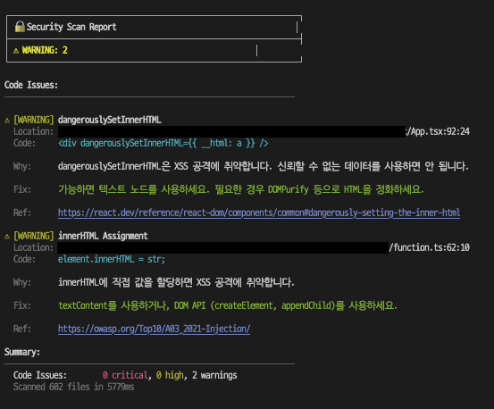
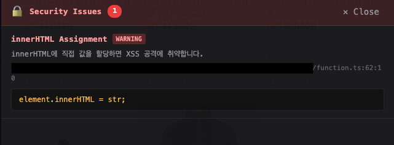

# vite-plugin-security

Build-time security scanner for Vite projects.

Detects hardcoded secrets, RSC server code leaks, XSS vulnerabilities, and other security issues at build time.

> Vite 프로젝트를 위한 빌드 타임 보안 스캐너입니다. 하드코딩된 시크릿, RSC 서버 코드 노출, XSS 취약점 등 보안 이슈를 빌드 시점에 탐지합니다.

## 스크린샷

### CLI 리포트 (`mode: 'full'`)

빌드 시 발견된 보안 이슈를 터미널에 상세하게 출력합니다.



### HMR Overlay (`mode: 'incremental'`)

개발 서버에서 실시간으로 보안 이슈를 브라우저에 표시합니다.



## 설치

```bash
npm install -D vite-plugin-security
# or
pnpm add -D vite-plugin-security
# or
yarn add -D vite-plugin-security
```

## 빠른 시작

```typescript
// vite.config.ts
import { defineConfig } from 'vite';
import { securityScanner } from 'vite-plugin-security';

export default defineConfig({
  plugins: [
    securityScanner({
      mode: process.env.CI ? 'full' : 'dry-run',
      failOn: 'critical',
    }),
  ],
});
```

## 옵션

```typescript
securityScanner({
  // 실행 모드
  // - 'incremental': HMR 시 변경 파일만 검사
  // - 'dry-run': 전체 검사, 리포트만 출력 (기본값)
  // - 'full': 전체 검사 + 의존성 취약점 검사 + 실패 시 exit
  mode: 'dry-run',

  // 검사 규칙 설정
  rules: {
    hardcodedSecrets: true, // 하드코딩된 시크릿 검사
    rscLeaks: true, // RSC 서버 코드 누출 검사
    dangerousPatterns: true, // 위험한 패턴 검사 (eval, innerHTML 등)
    dependencyAudit: 'ci', // 의존성 취약점 검사 ('always' | 'ci' | 'never')
    ignoreRules: [], // 무시할 규칙 key 목록
  },

  // 빌드 실패 조건 (해당 심각도 이상 발견 시)
  // false면 실패하지 않음
  failOn: 'critical', // 'critical' | 'high' | 'medium' | false

  // HMR 오버레이 설정
  overlay: {
    enabled: true,
    showOn: 'critical', // 'critical' | 'high' | 'all'
    position: 'top', // 'top' | 'bottom'
    autoHide: false, // 자동 숨김 시간 (초) 또는 false
  },

  // 검사 제외 파일 패턴 (glob)
  exclude: ['**/node_modules/**', '**/dist/**'],

  // 무시할 규칙 key 목록 (.ignoresecurity 파일과 병합됨)
  ignoreRules: ['eval', 'innerHTML'],
});
```

## 규칙 무시하기

특정 규칙을 무시하려면 두 가지 방법을 사용할 수 있습니다:

### 1. 플러그인 옵션에서 설정

```typescript
securityScanner({
  ignoreRules: ['eval', 'dangerouslySetInnerHTML', 'rsc-prisma'],
});
```

### 2. `.ignoresecurity` 파일 사용

프로젝트 루트에 `.ignoresecurity` 파일을 생성합니다:

```
# 이 프로젝트에서 eval 사용이 필요함
eval

# React의 dangerouslySetInnerHTML 허용 (sanitizer 사용 중)
dangerouslySetInnerHTML

# 특정 RSC 모듈 허용
rsc-lib-db
rsc-prisma
```

두 방법은 자동으로 병합됩니다.

---

## 이중 소스 보안 스캔

vite-plugin-security는 **두 가지 소스**에서 보안 이슈를 수집합니다:

### 1. 코드 스캔 (Code Scan)

소스코드를 직접 분석하여 보안 취약점을 탐지합니다:

- **하드코딩된 시크릿**: API 키, 토큰, 비밀번호 등
- **위험한 패턴**: `eval()`, `innerHTML`, SQL 인젝션 등
- **RSC 서버 코드 누출**: 클라이언트 컴포넌트에서 서버 모듈 import

### 2. 의존성 스캔 (OSV API)

[OSV.dev](https://osv.dev)는 Google이 운영하는 오픈소스 취약점 데이터베이스입니다. `package.json`의 의존성 패키지들을 OSV API에 조회하여 알려진 취약점(CVE)을 확인합니다.

**OSV 스캔이 제공하는 정보:**

| 항목          | 설명               | 예시                        |
| ------------- | ------------------ | --------------------------- |
| CVE ID        | 공식 취약점 식별자 | `CVE-2024-12345`            |
| 심각도        | CVSS 점수 기반     | Critical, High, Medium, Low |
| 영향받는 버전 | 취약한 버전 범위   | `>=1.0.0 <1.2.3`            |
| 패치 버전     | 수정된 버전        | `1.2.3`                     |
| 설명          | 취약점 상세 내용   | XSS vulnerability in...     |

**OSV 스캔 옵션:**

```typescript
securityScanner({
  rules: {
    // 의존성 취약점 검사 시점
    // - 'always': 항상 검사
    // - 'ci': CI 환경에서만 검사 (기본값)
    // - 'never': 검사 안 함
    dependencyAudit: 'ci',
  },
});
```

```bash
# CLI에서 OSV 스캔 제어
npx vite-plugin-security scan              # OSV 포함 (기본)
npx vite-plugin-security scan --no-osv     # OSV 제외 (코드만 스캔)
npx vite-plugin-security scan --include-dev # devDependencies도 검사
```

> 💡 **Tip**: 로컬 개발 시에는 `--no-osv`로 빠르게 코드만 검사하고, CI에서는 전체 스캔을 실행하는 것을 권장합니다.

---

## 검사 규칙 목록

### 위험한 패턴 (Dangerous Patterns)

코드 인젝션, XSS 등 보안 취약점을 일으킬 수 있는 패턴들입니다.

| Key                       | 이름                               | 심각도      | 설명                                                                   |
| ------------------------- | ---------------------------------- | ----------- | ---------------------------------------------------------------------- |
| `eval`                    | eval() Usage                       | 🔴 Critical | `eval()`은 문자열을 코드로 실행합니다. 코드 인젝션 공격에 취약합니다.  |
| `new-function`            | new Function() Usage               | 🔴 Critical | `new Function()`은 eval()과 동일한 보안 위험이 있습니다.               |
| `setTimeout-string`       | setTimeout/setInterval with string | 🟠 High     | setTimeout/setInterval에 문자열을 전달하면 eval()처럼 동작합니다.      |
| `dangerouslySetInnerHTML` | dangerouslySetInnerHTML            | 🟡 Warning  | XSS 공격에 취약합니다. DOMPurify 등 sanitizer 사용 시 자동 제외됩니다. |
| `innerHTML`               | innerHTML Assignment               | 🟡 Warning  | innerHTML에 직접 값을 할당하면 XSS 공격에 취약합니다.                  |
| `outerHTML`               | outerHTML Assignment               | 🟡 Warning  | outerHTML에 직접 값을 할당하면 XSS 공격에 취약합니다.                  |
| `document-write`          | document.write()                   | 🟠 High     | XSS 공격에 취약하고, 페이지 전체를 덮어쓸 수 있습니다.                 |
| `javascript-url`          | javascript: URL                    | 🔴 Critical | javascript: URL은 코드 인젝션에 사용될 수 있습니다.                    |
| `data-url-script`         | data: URL in script/iframe         | 🔴 Critical | data: URL은 악성 코드 실행에 사용될 수 있습니다.                       |
| `sql-injection`           | String Concatenation in SQL        | 🟠 High     | SQL 쿼리에서 문자열 연결은 SQL 인젝션에 취약합니다.                    |
| `fetch-credentials`       | Fetch without credentials          | ℹ️ Info     | fetch()에 credentials 옵션이 설정되지 않았습니다.                      |
| `math-random-security`    | Math.random() for security         | 🟠 High     | Math.random()은 암호학적으로 안전하지 않습니다.                        |
| `disabled-security-check` | Disabled Security Check            | 🟠 High     | 보안 검증이 비활성화되어 있습니다.                                     |
| `tls-reject-unauthorized` | NODE_TLS_REJECT_UNAUTHORIZED       | 🔴 Critical | TLS 인증서 검증이 비활성화되어 있습니다.                               |
| `prototype-pollution`     | Prototype Pollution Risk           | 🟠 High     | Prototype Pollution 공격에 취약한 코드 패턴입니다.                     |

### 하드코딩된 시크릿 (Hardcoded Secrets)

소스코드에 포함된 API 키, 토큰, 비밀번호 등을 탐지합니다.

| Key                 | 이름                       | 심각도      | 설명                                                 |
| ------------------- | -------------------------- | ----------- | ---------------------------------------------------- |
| `aws-access-key`    | AWS Access Key             | 🔴 Critical | AWS Access Key (`AKIA...`)                           |
| `aws-secret-key`    | AWS Secret Key             | 🔴 Critical | AWS Secret Key                                       |
| `openai-api-key`    | OpenAI API Key             | 🔴 Critical | OpenAI API 키 (`sk-...`)                             |
| `anthropic-api-key` | Anthropic API Key          | 🔴 Critical | Anthropic API 키 (`sk-ant-...`)                      |
| `stripe-api-key`    | Stripe API Key             | 🔴 Critical | Stripe API 키 (`sk_`, `pk_`, `rk_`)                  |
| `github-token`      | GitHub Token               | 🔴 Critical | GitHub 토큰 (`ghp_`, `gho_`, `ghu_`, `ghs_`, `ghr_`) |
| `google-api-key`    | Google API Key             | 🟠 High     | Google API 키 (`AIza...`)                            |
| `private-key`       | Private Key                | 🔴 Critical | 개인 키 (RSA, EC, DSA, OPENSSH)                      |
| `jwt-secret`        | JWT Secret                 | 🟠 High     | JWT 시크릿                                           |
| `database-url`      | Database Connection String | 🔴 Critical | 데이터베이스 연결 문자열 (인증 정보 포함)            |
| `generic-api-key`   | Generic API Key Assignment | 🟡 Warning  | 일반 API 키 할당 패턴                                |
| `password`          | Password Assignment        | 🟠 High     | 하드코딩된 비밀번호                                  |

### RSC 서버 코드 누출 (RSC Leak)

`'use client'` 컴포넌트에서 서버 전용 모듈을 import하는 경우를 탐지합니다.

| Key                    | 모듈             | 설명                                        |
| ---------------------- | ---------------- | ------------------------------------------- |
| `rsc-prisma`           | prisma           | Prisma ORM                                  |
| `rsc-prisma-client`    | @prisma/client   | Prisma Client                               |
| `rsc-drizzle`          | drizzle-orm      | Drizzle ORM                                 |
| `rsc-typeorm`          | typeorm          | TypeORM                                     |
| `rsc-sequelize`        | sequelize        | Sequelize ORM                               |
| `rsc-mongoose`         | mongoose         | Mongoose ODM                                |
| `rsc-knex`             | knex             | Knex.js Query Builder                       |
| `rsc-pg`               | pg               | PostgreSQL 드라이버                         |
| `rsc-mysql`            | mysql/mysql2     | MySQL 드라이버                              |
| `rsc-mongodb`          | mongodb          | MongoDB 드라이버                            |
| `rsc-redis`            | redis            | Redis 클라이언트                            |
| `rsc-ioredis`          | ioredis          | IORedis 클라이언트                          |
| `rsc-fs`               | fs               | Node.js 파일 시스템                         |
| `rsc-node-fs`          | node:fs          | Node.js 파일 시스템 (node: prefix)          |
| `rsc-fs-promises`      | fs/promises      | Node.js 파일 시스템 Promises                |
| `rsc-node-fs-promises` | node:fs/promises | Node.js 파일 시스템 Promises (node: prefix) |
| `rsc-bcrypt`           | bcrypt           | bcrypt 해싱                                 |
| `rsc-bcryptjs`         | bcryptjs         | bcrypt.js 해싱                              |
| `rsc-jsonwebtoken`     | jsonwebtoken     | JWT 라이브러리                              |
| `rsc-crypto`           | crypto           | Node.js 암호화 모듈                         |
| `rsc-node-crypto`      | node:crypto      | Node.js 암호화 모듈 (node: prefix)          |
| `rsc-lib-db`           | @/lib/db         | 커스텀 DB 모듈                              |
| `rsc-server-import`    | @/server         | 커스텀 서버 모듈                            |
| `rsc-server-module`    | ./\*server       | 서버 모듈 패턴                              |
| `rsc-dot-server`       | ./\*.server      | .server 파일 패턴                           |

---

## CLI 명령어

### scan - 보안 스캔 실행

```bash
# 전체 스캔 실행
npx vite-plugin-security scan

# JSON 형식으로 출력
npx vite-plugin-security scan --json

# CI에서 critical 이슈 발견 시 실패
npx vite-plugin-security scan --fail-on critical

# devDependencies 포함하여 의존성 검사
npx vite-plugin-security scan --include-dev

# OSV API 쿼리 건너뛰기
npx vite-plugin-security scan --no-osv
```

### init - GitHub Action 워크플로우 생성

정기적인 보안 스캔을 위한 GitHub Actions 워크플로우를 생성합니다.

```bash
# 서울 시간 새벽 4시에 스캔 (기본값)
npx vite-plugin-security init --timezone Asia/Seoul

# 특정 시간 지정 (오전 9시 30분)
npx vite-plugin-security init --timezone Asia/Seoul --time 09:30

# Slack 알림 활성화
npx vite-plugin-security init --timezone Asia/Seoul --slack

# 기존 워크플로우 덮어쓰기
npx vite-plugin-security init --timezone Asia/Seoul --force
```

**지원 타임존:**

- `Asia/Seoul`, `Asia/Tokyo`, `Asia/Shanghai`, `Asia/Singapore`
- `America/New_York`, `America/Los_Angeles`, `America/Chicago`
- `Europe/London`, `Europe/Paris`, `Europe/Berlin`
- `Australia/Sydney`, `UTC`

**생성되는 워크플로우 기능:**

- 지정된 시간에 자동 보안 스캔 실행
- 이슈 발견 시 GitHub Issue 자동 생성 (라벨: `security`, `critical`/`high`)
- Slack 웹훅 알림 (선택)
- GitHub Step Summary에 결과 표시

---

## Sanitizer 자동 감지

`dangerouslySetInnerHTML`과 `innerHTML`에서 sanitizer 함수 사용 시 자동으로 경고가 제외됩니다.

### 지원하는 Sanitizer 패턴

- `DOMPurify.sanitize()`
- `sanitize()`
- `purify()`
- `sanitizeHtml()`
- `xss()`
- `escapeHtml()`

### 예시

```tsx
// ✅ 경고 없음 - sanitizer 사용
<div dangerouslySetInnerHTML={{ __html: DOMPurify.sanitize(content) }} />

// ✅ 경고 없음 - 변수가 sanitizer로 생성됨
const safeHtml = DOMPurify.sanitize(userInput);
<div dangerouslySetInnerHTML={{ __html: safeHtml }} />

// ⚠️ Warning - sanitizer 미사용
<div dangerouslySetInnerHTML={{ __html: userInput }} />
```

---

## 심각도 레벨

| 레벨     | 아이콘 | 설명                                       |
| -------- | ------ | ------------------------------------------ |
| Critical | 🔴     | 즉시 수정 필요. 보안 사고로 직결될 수 있음 |
| High     | 🟠     | 높은 위험. 가능한 빨리 수정 권장           |
| Warning  | 🟡     | 주의 필요. 상황에 따라 허용 가능           |
| Info     | ℹ️     | 참고 정보. 개선 권장                       |

---

## 라이선스

MIT
